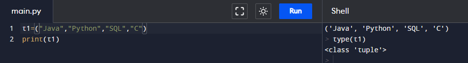
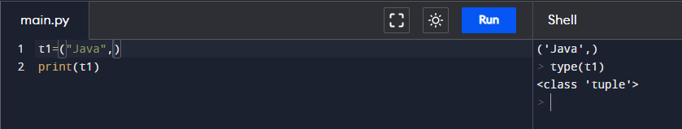
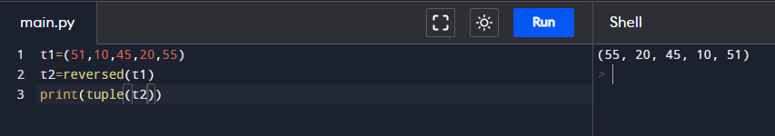
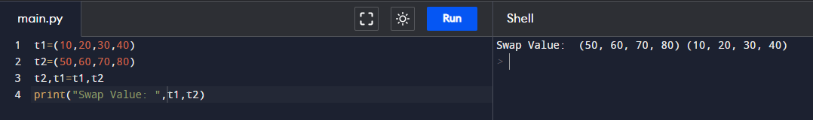
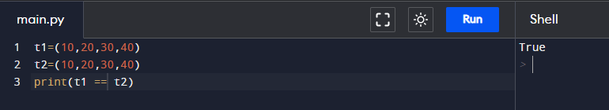
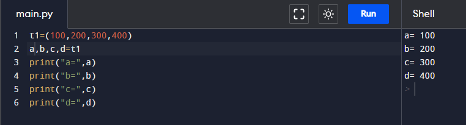
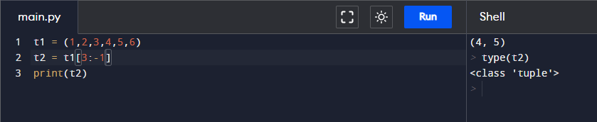
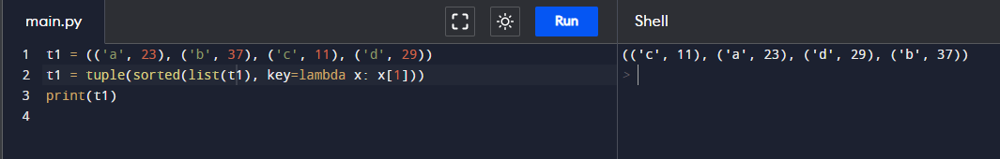
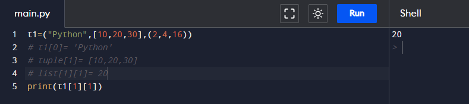
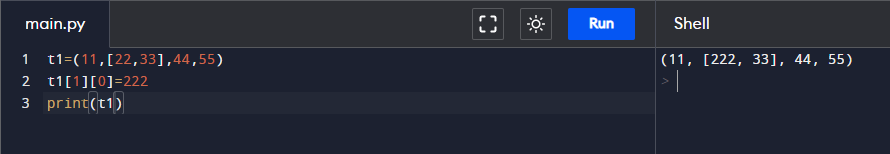

# Assignment - 16 Full Stack Web Development using Python MySirG Tuple

    Qns 1. Write a python script to store multiple items in a single variable 
    ( Items are “Java”, “Python”, “SQL”, “C” ) using tuple.

    Ans.

    Qns 2. Write a python program to store only one item using tuple.

    Ans.

    Qns 3. Write a python program to reverse the tuple.

    Ans.

    Qns 4. Write a python program to Swap two tuples in Python.

    Ans.

    Qns 5. Write a python program to check if all items in the tuple are the same.

    Ans.

    Qns 6. Write a python program to divide the tuple into four variables. 
    tuple1=(100, 200, 300, 400).

    Ans.

    Qns 7. Write a python program to copy elements 4 and 5 from the following tuple into a new tuple. tuple1=(1,2,3,4,5,6).

    Ans.

    Qns 8. Write a python program to Sort a tuple of tuples by the second item.      tuple1 = (('a', 21),('b', 37),('c', 11), ('d',29))

    Ans.

    Qns 9. Write a python program to print the value 20 from given nested tuple
    tuple1 = ("Python", [10, 20, 30], (2, 4, 16))

    Ans.

    Qns 10. Write a python program to change the first item (22) of a list within the following tuple
    to 222.
    tuple1 = (11, [22, 33], 44, 55)

    Ans.
